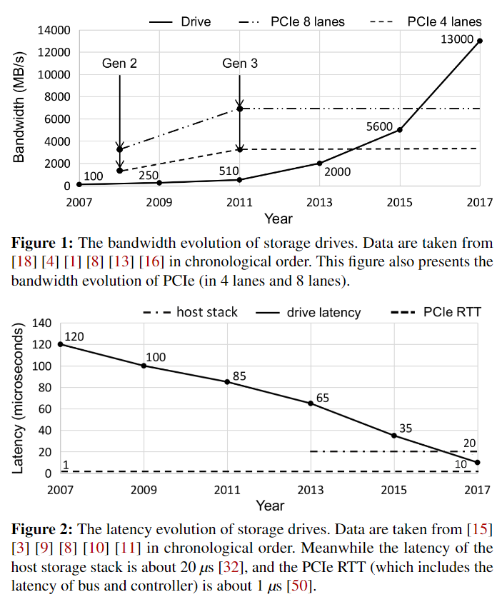

### 收集近年来的数据，对下图进行扩展，将存储器带宽和延迟发展补全。

## future work

> First, from the workload perspective, an extended programming model is desired to better support the data-dependent applications like key-value store. The current programming model forces host to initiate the drive access request, thus it cannot bypass the interconnection latency.

> 从工作负载的角度来看，需要一个扩展的编程模型来更好地支持依赖数据的应用程序，比如键值存储。当前的编程模型强制主机发起驱动器访问请求，因此它不能绕过互连延迟。

> Data-centric system architecture. Our long-term vision is to refactor the computer system into being data-centric. In the new architecture, CPU is only responsible for control plane processing, and it offloads data plane processing directly into the customized accelerator inside of IO devices, including storage drives, NICs, memory, etc.

> 我们的长期愿景是重构计算机系统，使其以数据为中心。在新的架构中，CPU只负责控制平面的处理，它将数据平面的处理直接卸载到IO设备内部的定制加速器，包括存储驱动器、网卡、内存等

k-v store在ISC架构下的实现，包括metadata的读取等问题、Data flow在ISC中的应用。

### 整理一个ISC发展的时间线

包括2014年的willow、2019年的insider这样的通用架构，也包括一些针对特定负载的架构。